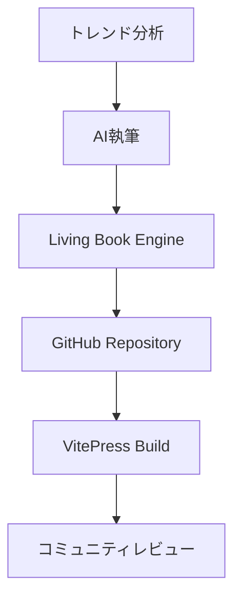
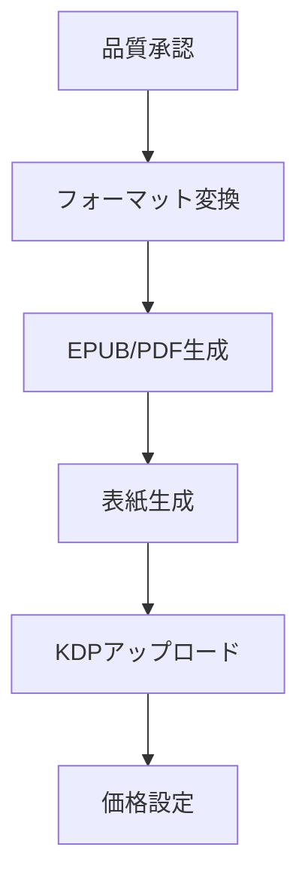

# KDP × Living Book Engine v2 統合戦略

## 🎯 統合コンセプト

### Living Book Engineの活用メリット
- **VitePress基盤**: 高品質なコンテンツレンダリング
- **GitHub協働**: コミュニティ参加型品質向上
- **Markdown中心**: AI生成コンテンツとの親和性
- **自動ビルド**: CI/CDパイプラインとの統合

### KDP自動化との統合ポイント
1. **コンテンツ生成** → Living Book Engineで執筆・編集
2. **品質管理** → コミュニティレビュー + AI校正
3. **フォーマット変換** → Markdown → EPUB/PDF
4. **自動出版** → KDPアップロード

## 🏗️ 統合アーキテクチャ

```
AI執筆エンジン → Living Book Engine → 品質管理 → KDP出版
     ↓              ↓                ↓         ↓
 GPT-4/Claude   VitePress/GitHub   AI校正   自動化API
```

### Phase 1: コンテンツ生成 & 管理


### Phase 2: 出版パイプライン


## 🛠️ 技術実装設計

### 1. Living Book Engine拡張
```javascript
// .vitepress/config.js 拡張
export default {
  title: 'AI Generated Books',
  description: 'Automated KDP Publishing Platform',
  
  // KDP特化設定
  kdp: {
    autoGenerate: true,
    outputFormats: ['epub', 'pdf'],
    categories: ['self-help', 'business', 'tech'],
    pricing: 'dynamic'
  },
  
  // AI統合設定
  ai: {
    providers: ['openai', 'anthropic'],
    quality: 'high',
    language: ['ja', 'en']
  }
}
```

### 2. GitHub Actions ワークフロー
```yaml
# .github/workflows/kdp-auto-publish.yml
name: KDP Auto Publish
on:
  push:
    paths: ['docs/**/*.md']
    
jobs:
  ai-review:
    runs-on: ubuntu-latest
    steps:
      - name: AI品質チェック
      - name: コンテンツ最適化
      
  format-convert:
    needs: ai-review
    steps:
      - name: EPUB変換
      - name: PDF生成
      - name: 表紙作成
      
  kdp-upload:
    needs: format-convert
    steps:
      - name: KDP API連携
      - name: 価格設定
      - name: 出版実行
```

### 3. AI統合モジュール
```python
# ai_content_generator.py
class AIContentGenerator:
    def __init__(self):
        self.providers = ['openai', 'anthropic']
        self.quality_threshold = 0.8
    
    def generate_book(self, topic, length=50000):
        # トレンド分析
        trends = self.analyze_trends(topic)
        
        # 構成生成
        structure = self.create_structure(trends)
        
        # 執筆実行
        content = self.write_content(structure)
        
        # Living Book Engineに投入
        return self.deploy_to_living_book(content)
    
    def deploy_to_living_book(self, content):
        # GitHub Repositoryに自動コミット
        # VitePress形式で整形
        # Pull Request作成
        pass
```

## 📊 自動化フロー詳細

### 日次実行サイクル
```
06:00 - トレンド分析実行
07:00 - AIコンテンツ生成開始
12:00 - Living Book Engineにデプロイ
14:00 - コミュニティレビュー開始
18:00 - 品質チェック完了
20:00 - KDP出版実行
22:00 - 売上・分析レポート
```

### 品質管理システム
1. **AI初期品質チェック** (自動)
2. **Living Book Community Review** (半自動)
3. **最終AI校正** (自動)
4. **出版前最終確認** (自動)

## 💰 収益最大化戦略

### 価格戦略
- **ベーシック版**: $2.99 (AI生成のみ)
- **コミュニティ改良版**: $4.99 (レビュー済み)
- **プレミアム版**: $9.99 (専門家監修)

### マーケティング自動化
```javascript
// marketing_automation.js
class KDPMarketing {
    async optimizeBook(bookId) {
        // SEOキーワード最適化
        await this.optimizeKeywords(bookId);
        
        // カテゴリ最適化
        await this.optimizeCategories(bookId);
        
        // 価格動的調整
        await this.dynamicPricing(bookId);
        
        // レビュー管理
        await this.manageReviews(bookId);
    }
}
```

## 🎮 実装ロードマップ

### Week 1-2: 基盤構築
- [ ] Living Book Engine環境セットアップ
- [ ] AI執筆モジュール実装
- [ ] GitHub Actions基本ワークフロー

### Week 3-4: 統合テスト
- [ ] エンドツーエンドテスト
- [ ] 品質管理システム調整
- [ ] KDP連携テスト

### Month 2: スケールアップ
- [ ] 複数ジャンル対応
- [ ] 多言語展開
- [ ] 収益最適化実装

## 🚨 リスク対策

### 技術リスク
- **GitHub API制限**: 複数アカウント運用
- **VitePress障害**: バックアップシステム
- **KDP規約変更**: 監視・自動対応

### 品質リスク
- **AI幻覚**: 多段階検証システム
- **著作権問題**: オリジナリティチェック
- **コミュニティ品質**: レビュアー評価システム

## 📈 成功指標

### KPI設定
- **日次出版数**: 1冊/日
- **品質スコア**: 4.0/5.0以上
- **収益率**: $100/日以上
- **コミュニティ参加率**: 月50%成長

# Last Updated: 2025-06-29 04:21:00 JST